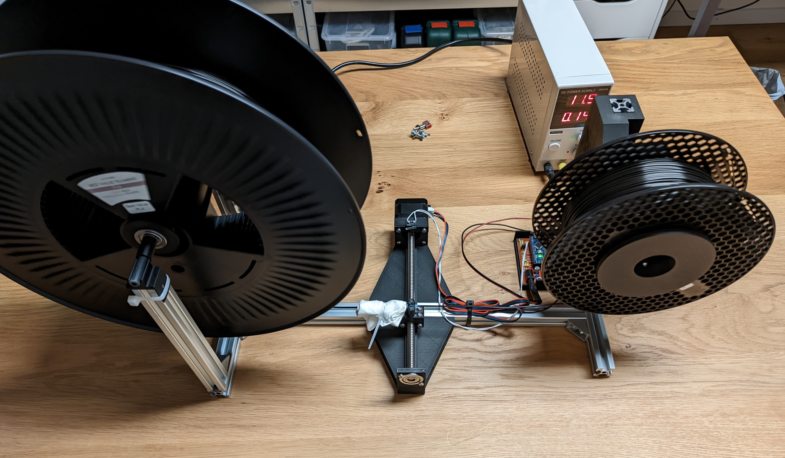

# Filament-Winder

This setup was built to wind from a 4.5kg spool to a 1kg spool.  
It is very slow (~0.5h for 1kg) but it works and does not need babysitting.  
\
The idler makes for a even winding pattern and the limit of 600 revolutions fills the spool tu just the right amount, so it will fits in my AMS unit.  
\
The code and the STEP file are included if anyone wants to build one.